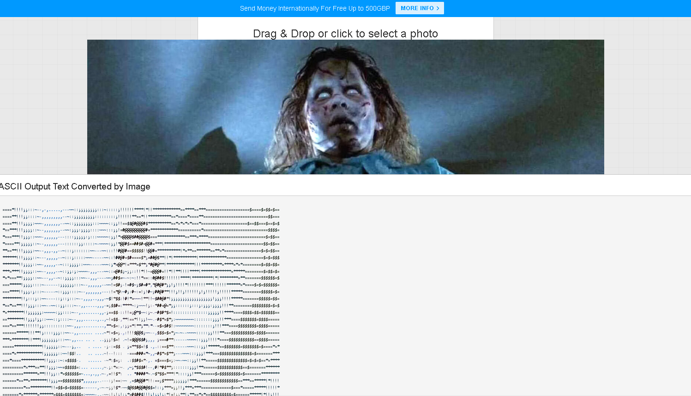

# magicbiff
Multi-color Ascii GraphICs from Binary Image File Formats

I linked my image-to-text web application (which I have now dubbed [MAGICBIFF](https://www.killsignal.net/img2txt/ascii-art.html)), with explanation of why I made yet another such app along with examples of what it does at the preceding link) in a comment on a [HN thread about another ascii art tool](https://news.ycombinator.com/item?id=38329736) and had a couple of folks reply and ask if the source was available.

Since it runs entirely in the browser, the source (HTML/CSS/JS) is of course available as it is sent over https when requested and can be seen as plain text via view-source or the Inspector.   It then occurred to me that even so, perhaps they wanted to be able to be notified of changes, fork, submit PR, etc.. all the stuff that  site like GitHub makes easily available. 

So, as promised, I have cleaned the code up at least to the point where it doesn't embarrass me to associate it with my name, and here you shall find it. I have a black&white version and a color version (this is the color version at the moment) that I'll want to consolidate, because there are some tradeoffs between "resolution" and colorization that some may find interesting. 

# Example live web deployment link 
[magicbiff](https://www.killsignal.net/magicbiff)

# Installation/Configuration
Short version: clone this repo. Wherever you place the directory, just access the index.html file with a web browser. (The directory URI is probably enough, without the "index.html" filename if being served via a webserver.)

Overly-verbose version: Placing the index.html file in the location of your choosing (e.g., your local filesystem or on a public webserver) given the filename of your choice and opening it in a modern browser that supports CSS, JS, and the Canvas element should be all that is needed to run the app in its current state exactly as the one on [my site](https://www.killsignal.net/magicbiff) works. Of course you are free to rename any of the files and use as-is, or as example (or not-at-all) the [comparisons_and_examples](https://www.killsignal.net/magicbiff/comparisons_and_examples.html) page and images.    

# Additional info
I have recently uploaded the original b&w version of the tool since I think the vertical line spacing trick has its own value, complementing the current color version. While it is not possible to use both the drop shadow bgcolor trick and the vertical space squishing trick together, a version that uses colored characters and the vertical spacing effect together should be pretty easy. Until then, it is usable on its own.  
________

MAGICBIFF - A better online image-to-ascii converter tool
=========================================================

([magicbiff on github](/https://github.com/scottvr/magicbiff)) | [magicbiff in action](https://www.killsignal.net/magicbiff)  

* * *

  
  

WIth all the hubbub and hoohah surrounding "text-to-image" applications that use machine learning models _(aside: I use the terms hubbub and hoohah affectionately. I spend far too much time generating media with GANs, diffusion models, transformers (oh my!); don't think otherwise, please)_ to generate high-quality images given only a text prompt as input, the phrases "text-to-image" and "image-to-text" have presented themselves to me several times recently. The terms caused me to think of ASCII and ANSI art from my BBS days and that caused me to search for online raster image to ascii conversion tools. I found there are several, but found their output lacking in the visual appeal department. For example, take this frame from the film "The Exorcist", of Regan MacNeil levitating above her bed:  

  

* * *

  

  

example of a popular online tool
================================

Now let's look at the output from one of the top search results by dragging that image into the file upload box of the tool at [codebeautify.org:](codebeautify.org)  

It isn't spectacular-looking, for sure. The image is barely recognizable without the source frame as a hint..

  

Another top search result.
==========================

Here is the output of the next randomly selected top search result. This time I searched for "a better image to ascii tool online" and this site ([helloacm.com](helloacm.com)) was returned.  

I'm sorry to say, but this result is even worse than the last, using the same input image of Regan.

  

* * *

  

  

an additional online solution.
==============================

  
recently seen: [asciiart.club](https://asciiart.club/). I have added this one because it is presently the top Google result for whatever my search term was and is listed by its title which claims to be an _Online **"HD"** Color Image to Text Converter_ (emphasis on "HD" is mine.) To its credit, it also appears to run entirely in browser like my tool, and to either its credit or detriment is quite a bit more code than mine here, and another potential positive point for this one it has selectable options (which mine does not at the moment) but these options might be a con, since I suspect they are the reason the gallery of user-created images all look, well, not great as with the others mentioned avove. I'm not screenshotting, but there is the link above so you can check it out. Maybe it is actually capable of nice-looking output with the right selection of options for your input image.

  

* * *

  

And now, magicbiff, a better tool
=================================

Now that same 1400x700 image as processed by my tool at [killsignal.net](="/img2txt")  

NEW!
====

### the new color version of the tool outputs an image very close to the source, even at the much lower resolution, using ascii and html/css to color the letters and the background of each letter. Additionally, I added a drop shadow to the letters of a different shade of the same hue to, well you can see the effect below.

I have zoomed in on the screenshot and pasted the magnified square in the upper left of the image below so that you can see the characters. The gray/white highlighted part is exsctly that... I selected a few lines of text to highlight them in the browser before taking the screenshot, just to make them easier to see.

  

Not bad, even if I say so myself.

* * *

the older (but still better than those other two) version
=========================================================

Now that same 1400x700 image as processed by (the original b&w version) of my img2txt tool at [killsignal.net](="/img2txt")  

That's much better. But is that ASCII? Yes, it is\*\*. Let's take a closer look  

_________

  

* * *

and a little more zoom:  

_______

  

  

* * *

It's a whole lot better, if I may say so myself. [Check it out for yourself.](/img2txt) and make your own ASCII art.
====================================================================================================================

  

* * *

_\*\*I suppose that technically it's outputting html, and that if copy/pasted into a plain ascii text document the css trick of eliminating the space between lines for denser coverage will be lost. Even without the css formatting, the output is improved._

_  

* * *
 

[magicbiff](https://github.com/scottvr/magicbiff/) (c) 2023 scottvr at paperclipmaximizer dot ai
